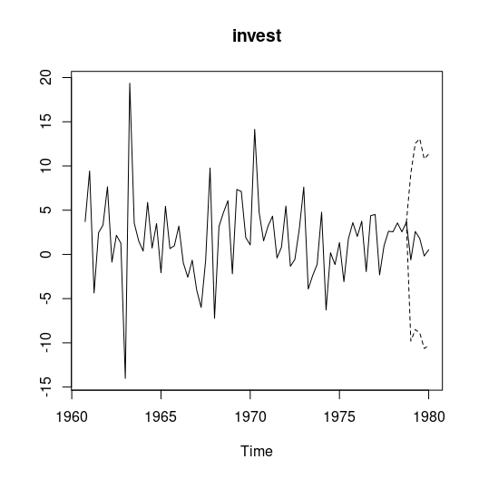
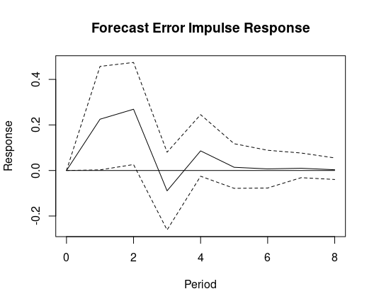
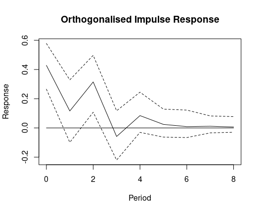
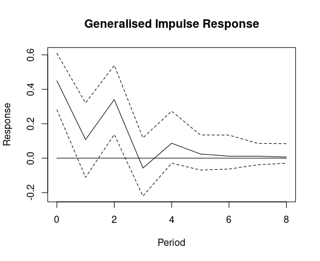

# bvartools

[](https://cran.r-project.org/package=bvartools)
[](https://github.com/franzmohr/bvartools/actions)

## Overview

The package `bvartools` implements functions for Bayesian inference of
linear vector autoregressive (VAR) models. It separates a typical BVAR
analysis workflow into multiple steps:

-   *Model set-up*: Produces data matrices for given lag orders and
    model types, which can be used for posterior simulation.
-   *Prior specification*: Generates prior matrices for a given model.
-   *Estimation*: Researchers can choose to use the posterior algorithms
    of the package or use their own algorithms.
-   *Standardising model output*: Combines the output of the estimation
    step into standardised objects for subsequent steps of the analyis.
-   *Evaluation*: Produces summary statistics, forecasts, impulse
    responses and forecast error variance decompositions.

In each step researchers are provided with the opportunitiy to fine-tune
a model according to their specific requirements or to use the default
framework for commonly used models and priors. Since version 0.1.0 the
package comes with posterior simulation functions that do not require to
implement any further simulation algorithms. For Bayesian inference of
*stationary VAR models* the package covers

-   Standard BVAR models with independent normal-Wishart priors
-   BVAR models employing stochastic search variable selection à la
    Gerorge, Sun and Ni (2008)
-   BVAR models employing Bayesian variable selection à la
    Korobilis (2013)
-   Structural BVAR models, where the structural coefficients are
    estimated from contemporary endogenous variables (A-model)
-   Stochastic volatility (SV) of the errors à la Kim, Shephard and
    Chip (1998)
-   Time varying parameter models (TVP-VAR)

For Bayesian inference of *cointegrated VAR models* the package
implements the algorithm of Koop, León-González and Strachan (2010)
\[KLS\] – which places identification restrictions on the cointegration
space – in the following variants

-   The BVEC model as presented in Koop, León-González and
    Strachan (2010)
-   The KLS model employing stochastic search variable selection à la
    Gerorge, Sun and Ni (2008)
-   The KLS modol employing Bayesian variable selection à la
    Korobilis (2013)
-   Structural BVEC models, where the structural coefficients are
    estimated from contemporaneous endogenous variables (A-model).
    However, no further restrictions are made regarding the
    cointegration term.
-   Stochastic volatility (SV) of the errors à la Kim, Shephard and
    Chip (1998)
-   Time varying parameter models (TVP-VEC) à la Koop, León-González and
    Strachan (2011)[1]

For Bayesian inference of *dynamic factor models* the package implements
the althorithm used in the textbook of Chan, Koop, Poirer and Tobias
(2019).

Similar packages worth checking out are

-   [BVAR](https://cran.r-project.org/package=BVAR)
-   [bvarsv](https://cran.r-project.org/package=bvarsv)
-   [bvar](https://github.com/nk027/bvar)
-   [bvarr](https://github.com/bdemeshev/bvarr)
-   [bvars](https://github.com/joergrieger/bvars)
-   [mfbvar](https://github.com/ankargren/mfbvar)
-   [BMR](https://github.com/kthohr/BMR)

## Installation

``` r
install.packages("bvartools")
```

### Development version

``` r
# install.packages("devtools")
devtools::install_github("franzmohr/bvartools")
```

## Usage

This example covers the estimation of a simple Bayesian VAR (BVAR)
model. For further examples on time varying parameter (TVP), stochastic
volatility (SV), and vector error correction (VEC) models as well as
shrinkage methods like stochastic search variable selection (SSVS) or
Bayesian variable selection (BVS) see the vignettes of the package and
[r-econometrics.com](https://www.r-econometrics.com/timeseriesintro/).

### Data

To illustrate the estimation process the dataset E1 from Lütkepohl
(2006) is used. It contains data on West German fixed investment,
disposable income and consumption expenditures in billions of DM from
1960Q1 to 1982Q4. Like in the textbook only the first 73 observations of
the log-differenced series are used.

``` r
library(bvartools)
```

    ## Loading required package: coda

``` r
# Load data
data("e1")
e1 <- diff(log(e1)) * 100

# Reduce number of oberservations
e1 <- window(e1, end = c(1978, 4))

# Plot the series
plot(e1)
```


### Setting up a model

The `gen_var` function produces an object, which contains information on
the specification of the VAR model that should be estimated. The
following code specifies a VAR(2) model with an intercept term. The
number of iterations and burn-in draws is already specified at this
stage.

``` r
model <- gen_var(e1, p = 2, deterministic = "const",
                 iterations = 5000, burnin = 1000)
```

Note that the function is also capable of generating more than one
model. For example, specifying `p = 0:2` would result in three models.

### Adding model priors

Function `add_priors` produces priors for the specified model(s) in
object `model` and augments the object accordingly.

``` r
model_with_priors <- add_priors(model,
                                coef = list(v_i = 0, v_i_det = 0),
                                sigma = list(df = 1, scale = .0001))
```

If researchers want to fine-tune individual prior specifications, this
can be done by directly accessing the respective elements in object
`model_with_priors`.

### Estimation

The output of `add_priors` can be used as the input for user-written
algorithms for posterior simulation. However, `bvartools` also comes
with built-in posterior simulation functions, which can be directly
applied to the output of the prior specification step by using function
`draw_posterior`:

``` r
bvar_est <- draw_posterior(model_with_priors)
```

The following code sets up a simple Gibbs sampler algorithm.

``` r
# Reset random number generator for reproducibility
set.seed(1234567)

iterations <- 10000 # Number of saved iterations of the Gibbs sampler
burnin <- 5000 # Number of burn-in draws
draws <- iterations + burnin # Total number of MCMC draws

y <- t(model_with_priors$data$Y)
x <- t(model_with_priors$data$Z)

tt <- ncol(y) # Number of observations
k <- nrow(y) # Number of endogenous variables
m <- k * nrow(x) # Number of estimated coefficients

# Set (uninformative) priors
a_mu_prior <- model_with_priors$priors$coefficients$mu # Vector of prior parameter means
a_v_i_prior <- model_with_priors$priors$coefficients$v_i # Inverse of the prior covariance matrix

u_sigma_df_prior <- model_with_priors$priors$sigma$df # Prior degrees of freedom
u_sigma_scale_prior <- model_with_priors$priors$sigma$scale # Prior covariance matrix
u_sigma_df_post <- tt + u_sigma_df_prior # Posterior degrees of freedom

# Initial values
u_sigma_i <- diag(1 / .00001, k)

# Data containers for posterior draws
draws_a <- matrix(NA, m, iterations)
draws_sigma <- matrix(NA, k^2, iterations)

# Start Gibbs sampler
for (draw in 1:draws) {
  # Draw conditional mean parameters
  a <- post_normal(y, x, u_sigma_i, a_mu_prior, a_v_i_prior)
  
  # Draw variance-covariance matrix
  u <- y - matrix(a, k) %*% x # Obtain residuals
  u_sigma_scale_post <- solve(u_sigma_scale_prior + tcrossprod(u))
  u_sigma_i <- matrix(rWishart(1, u_sigma_df_post, u_sigma_scale_post)[,, 1], k)
  u_sigma <- solve(u_sigma_i) # Invert Sigma_i to obtain Sigma
  
  # Store draws
  if (draw > burnin) {
    draws_a[, draw - burnin] <- a
    draws_sigma[, draw - burnin] <- u_sigma
  }
}
```

### `bvar` objects

Function `bvar` can be used to collect relevant output of the Gibbs
sampler in a standardised object, which can be used by further
applications such as `predict` to obtain forecasts or `irf` for impulse
respons analysis.

``` r
bvar_est <- bvar(y = model_with_priors$data$Y,
                 x = model_with_priors$data$Z,
                 A = draws_a[1:18,],
                 C = draws_a[19:21, ],
                 Sigma = draws_sigma)
```

Summary statistics can be obained in the usual manner:

``` r
summary(bvar_est)
```

    ## 
    ## Bayesian VAR model with p = 2 
    ## 
    ## Model:
    ## 
    ## y ~ invest.01 + income.01 + cons.01 + invest.02 + income.02 + cons.02 + const
    ## 
    ## Variable: invest 
    ## 
    ##              Mean     SD Naive SD Time-series SD    2.5%     50%    97.5%
    ## invest.01 -0.3210 0.1280 0.001280       0.001286 -0.5734 -0.3216 -0.06831
    ## income.01  0.1472 0.5654 0.005654       0.005654 -0.9602  0.1439  1.26083
    ## cons.01    0.9662 0.6768 0.006768       0.006778 -0.3453  0.9560  2.32034
    ## invest.02 -0.1600 0.1263 0.001263       0.001305 -0.4049 -0.1612  0.08747
    ## income.02  0.1036 0.5519 0.005519       0.005439 -0.9653  0.1010  1.19676
    ## cons.02    0.9348 0.6894 0.006894       0.006894 -0.4165  0.9283  2.28239
    ## const     -1.6637 1.7556 0.017556       0.017556 -5.1131 -1.6428  1.81572
    ## 
    ## Variable: income 
    ## 
    ##                Mean      SD  Naive SD Time-series SD     2.5%       50%  97.5%
    ## invest.01  0.043539 0.03283 0.0003283      0.0003340 -0.02134  0.043640 0.1078
    ## income.01 -0.152587 0.14272 0.0014272      0.0014354 -0.43484 -0.152102 0.1278
    ## cons.01    0.287003 0.17215 0.0017215      0.0017583 -0.05264  0.284572 0.6301
    ## invest.02  0.049836 0.03215 0.0003215      0.0003215 -0.01315  0.049738 0.1135
    ## income.02  0.019209 0.13846 0.0013846      0.0013846 -0.25074  0.020273 0.2888
    ## cons.02   -0.008994 0.17079 0.0017079      0.0017079 -0.34237 -0.009633 0.3335
    ## const      1.577324 0.44978 0.0044978      0.0044978  0.69837  1.573286 2.4624
    ## 
    ## Variable: cons 
    ## 
    ##                Mean      SD  Naive SD Time-series SD      2.5%       50%
    ## invest.01 -0.002623 0.02648 0.0002648      0.0002648 -0.054699 -0.002433
    ## income.01  0.223178 0.11668 0.0011668      0.0011668 -0.003841  0.222297
    ## cons.01   -0.263006 0.13888 0.0013888      0.0013888 -0.539179 -0.262530
    ## invest.02  0.033789 0.02612 0.0002612      0.0002612 -0.017709  0.033990
    ## income.02  0.354398 0.11138 0.0011138      0.0011302  0.131559  0.356159
    ## cons.02   -0.020351 0.13878 0.0013878      0.0013661 -0.294508 -0.019763
    ## const      1.292296 0.35786 0.0035786      0.0035786  0.590719  1.290012
    ##              97.5%
    ## invest.01 0.049704
    ## income.01 0.449267
    ## cons.01   0.007515
    ## invest.02 0.085769
    ## income.02 0.571058
    ## cons.02   0.254939
    ## const     2.006569
    ## 
    ## Variance-covariance matrix:
    ## 
    ##                  Mean     SD Naive SD Time-series SD    2.5%     50%  97.5%
    ## invest_invest 22.3072 4.0178 0.040178       0.044990 15.8399 21.7999 31.327
    ## invest_income  0.7561 0.7313 0.007313       0.008046 -0.6330  0.7286  2.294
    ## invest_cons    1.2956 0.6022 0.006022       0.006781  0.2157  1.2701  2.576
    ## income_invest  0.7561 0.7313 0.007313       0.008046 -0.6330  0.7286  2.294
    ## income_income  1.4378 0.2610 0.002610       0.002854  1.0191  1.4057  2.038
    ## income_cons    0.6442 0.1690 0.001690       0.001873  0.3596  0.6280  1.032
    ## cons_invest    1.2956 0.6022 0.006022       0.006781  0.2157  1.2701  2.576
    ## cons_income    0.6442 0.1690 0.001690       0.001873  0.3596  0.6280  1.032
    ## cons_cons      0.9348 0.1681 0.001681       0.001872  0.6610  0.9141  1.312

The means of the posterior draws are very close to the results of the
frequentist estimatior in Lütkepohl (2006).

### Inspect posterior draws

Posterior draws can be visually inspected by using the `plot` function.
By default, it produces a series of histograms of all estimated
coefficients.

``` r
plot(bvar_est)
```


Alternatively, the trace plot of the post-burnin draws can be draws by
adding the argument `type = "trace"`:

``` r
plot(bvar_est, type = "trace")
```


### Summary statistics

Summary statistics can be obtained in the usual way using the `summary`
method.

``` r
summary(bvar_est)
```

    ## 
    ## Bayesian VAR model with p = 2 
    ## 
    ## Model:
    ## 
    ## y ~ invest.01 + income.01 + cons.01 + invest.02 + income.02 + cons.02 + const
    ## 
    ## Variable: invest 
    ## 
    ##              Mean     SD Naive SD Time-series SD    2.5%     50%    97.5%
    ## invest.01 -0.3210 0.1280 0.001280       0.001286 -0.5734 -0.3216 -0.06831
    ## income.01  0.1472 0.5654 0.005654       0.005654 -0.9602  0.1439  1.26083
    ## cons.01    0.9662 0.6768 0.006768       0.006778 -0.3453  0.9560  2.32034
    ## invest.02 -0.1600 0.1263 0.001263       0.001305 -0.4049 -0.1612  0.08747
    ## income.02  0.1036 0.5519 0.005519       0.005439 -0.9653  0.1010  1.19676
    ## cons.02    0.9348 0.6894 0.006894       0.006894 -0.4165  0.9283  2.28239
    ## const     -1.6637 1.7556 0.017556       0.017556 -5.1131 -1.6428  1.81572
    ## 
    ## Variable: income 
    ## 
    ##                Mean      SD  Naive SD Time-series SD     2.5%       50%  97.5%
    ## invest.01  0.043539 0.03283 0.0003283      0.0003340 -0.02134  0.043640 0.1078
    ## income.01 -0.152587 0.14272 0.0014272      0.0014354 -0.43484 -0.152102 0.1278
    ## cons.01    0.287003 0.17215 0.0017215      0.0017583 -0.05264  0.284572 0.6301
    ## invest.02  0.049836 0.03215 0.0003215      0.0003215 -0.01315  0.049738 0.1135
    ## income.02  0.019209 0.13846 0.0013846      0.0013846 -0.25074  0.020273 0.2888
    ## cons.02   -0.008994 0.17079 0.0017079      0.0017079 -0.34237 -0.009633 0.3335
    ## const      1.577324 0.44978 0.0044978      0.0044978  0.69837  1.573286 2.4624
    ## 
    ## Variable: cons 
    ## 
    ##                Mean      SD  Naive SD Time-series SD      2.5%       50%
    ## invest.01 -0.002623 0.02648 0.0002648      0.0002648 -0.054699 -0.002433
    ## income.01  0.223178 0.11668 0.0011668      0.0011668 -0.003841  0.222297
    ## cons.01   -0.263006 0.13888 0.0013888      0.0013888 -0.539179 -0.262530
    ## invest.02  0.033789 0.02612 0.0002612      0.0002612 -0.017709  0.033990
    ## income.02  0.354398 0.11138 0.0011138      0.0011302  0.131559  0.356159
    ## cons.02   -0.020351 0.13878 0.0013878      0.0013661 -0.294508 -0.019763
    ## const      1.292296 0.35786 0.0035786      0.0035786  0.590719  1.290012
    ##              97.5%
    ## invest.01 0.049704
    ## income.01 0.449267
    ## cons.01   0.007515
    ## invest.02 0.085769
    ## income.02 0.571058
    ## cons.02   0.254939
    ## const     2.006569
    ## 
    ## Variance-covariance matrix:
    ## 
    ##                  Mean     SD Naive SD Time-series SD    2.5%     50%  97.5%
    ## invest_invest 22.3072 4.0178 0.040178       0.044990 15.8399 21.7999 31.327
    ## invest_income  0.7561 0.7313 0.007313       0.008046 -0.6330  0.7286  2.294
    ## invest_cons    1.2956 0.6022 0.006022       0.006781  0.2157  1.2701  2.576
    ## income_invest  0.7561 0.7313 0.007313       0.008046 -0.6330  0.7286  2.294
    ## income_income  1.4378 0.2610 0.002610       0.002854  1.0191  1.4057  2.038
    ## income_cons    0.6442 0.1690 0.001690       0.001873  0.3596  0.6280  1.032
    ## cons_invest    1.2956 0.6022 0.006022       0.006781  0.2157  1.2701  2.576
    ## cons_income    0.6442 0.1690 0.001690       0.001873  0.3596  0.6280  1.032
    ## cons_cons      0.9348 0.1681 0.001681       0.001872  0.6610  0.9141  1.312

### Thin results

The MCMC series in object `est_bvar` can be thinned using

``` r
bvar_est <- thin(bvar_est, thin = 10)
```

### Forecasts

Forecasts can be obtained with the function `predict`. If the model
contains deterministic terms, new values have to be provided in the
argument `new_D`, which must be of the same length as the argument
`n.ahead`.

``` r
bvar_pred <- predict(bvar_est, n.ahead = 5, new_D = rep(1, 5))

plot(bvar_pred)
```

<!-- -->

### Impulse response analysis

#### Forecast error impulse response

``` r
IR <- irf(bvar_est, impulse = "income", response = "cons", n.ahead = 8)

plot(IR, main = "Forecast Error Impulse Response", xlab = "Period", ylab = "Response")
```

<!-- -->

#### Orthogonalised impulse response

``` r
OIR <- irf(bvar_est, impulse = "income", response = "cons", n.ahead = 8, type = "oir")

plot(OIR, main = "Orthogonalised Impulse Response", xlab = "Period", ylab = "Response")
```

<!-- -->

#### Generalised impulse response

``` r
GIR <- irf(bvar_est, impulse = "income", response = "cons", n.ahead = 8, type = "gir")

plot(GIR, main = "Generalised Impulse Response", xlab = "Period", ylab = "Response")
```

<!-- -->

### Forecast error variance decomposition

``` r
bvar_fevd <- fevd(bvar_est, response = "cons")

plot(bvar_fevd, main = "FEVD of consumption")
```

<!-- -->

## References

Eddelbuettel, D., & Sanderson C. (2014). RcppArmadillo: Accelerating R
with high-performance C++ linear algebra. *Computational Statistics and
Data Analysis, 71*, 1054-1063.
<https://doi.org/10.1016/j.csda.2013.02.005>

George, E. I., Sun, D., & Ni, S. (2008). Bayesian stochastic search for
VAR model restrictions. *Journal of Econometrics, 142*(1), 553-580.
<https://doi.org/10.1016/j.jeconom.2007.08.017>

Kim, S., Shephard, N., & Chib, S. (1998). Stochastic volatility:
Likelihood inference and comparison with ARCH models. *Review of
Economic Studies 65*(3), 361-396.

Koop, G., León-González, R., & Strachan R. W. (2010). Efficient
posterior simulation for cointegrated models with priors on the
cointegration space. *Econometric Reviews, 29*(2), 224-242.
<https://doi.org/10.1080/07474930903382208>

Koop, G., León-González, R., & Strachan R. W. (2011). Bayesian inference
in a time varying cointegration model. *Journal of Econometrics,
165*(2), 210-220. <https://doi.org/10.1016/j.jeconom.2011.07.007>

Korobilis, D. (2013). VAR forecasting using Bayesian variable selection.
*Journal of Applied Econometrics, 28*(2), 204-230.
<https://doi.org/10.1002/jae.1271>

Lütkepohl, H. (2006). *New introduction to multiple time series
analysis* (2nd ed.). Berlin: Springer.

Pesaran, H. H., & Shin, Y. (1998). Generalized impulse response analysis
in linear multivariate models. *Economics Letters, 58*, 17-29.
<https://doi.org/10.1016/S0165-1765(97)00214-0>

Sanderson, C., & Curtin, R. (2016). Armadillo: a template-based C++
library for linear algebra. *Journal of Open Source Software, 1*(2), 26.
<https://doi.org/10.21105/joss.00026>

[1] In contrast to Koop et al. (2011) version 0.2.1 assumes a fixed
value for the autocorrelation coefficient of the time varying
cointegration space. A step for drawing this coefficient will be
introduced in a future release.
