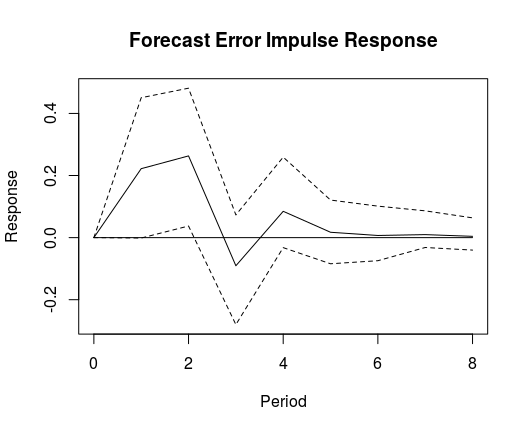
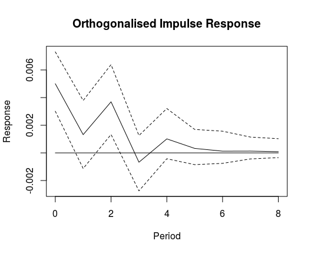

bvartools
=========

[](https://cran.r-project.org/package=bvartools) [](https://travis-ci.org/franzmohr/bvartools)

Overview
--------

The package `bvartools` implements some common functions used for Bayesian inference for mulitvariate time series models. The package should give researchers maximum freedom in setting up a Gibbs sampler in R and keep calculation time limited at the same time. This is achieved by implementing posterior simultion functions in C++. Its main features are

-   Posterior simulation functions, which are written in C++ for faster calculation
-   The `bvars` function collects the output of a Gibbs sampler in a standardised object, which can be used for further analyses
-   Functions for further analyses such as `irf` for impulse response analysis

Installation
------------

### Development version

``` r
# install.packages("devtools")
devtools::install_github("franzmohr/bvartools")
```

Usage
-----

This example covers the estimation of a simple BVAR model. For further examples on time varying parameter (TVP), stochastic volatility (SV), and vector error correction models as well as shrinkage methods like stochastic search variable selection (SSVS) or Bayesian variable selection (BVS) see the vignettes of the package.

### Data

To illustrate the estimation process the dataset E1 from Lütkepohl (2007) is used. It contains data on West German fixed investment, disposable income and consumption expenditures in billions of DM from 1960Q1 to 1982Q4.

``` r
library(bvartools)

data("e1")
e1 <- diff(log(e1))

plot(e1) # Plot the series
```


### Prepare data for estimation

The `gen_var` function produces the inputs `y` and `x` for the BVAR estimator, where `y` is the matrix of dependent variables and `x` is the matrix of regressors.

``` r
data <- gen_var(e1, p = 2, deterministic = "const")

y <- data$Y[, 1:73]
x <- data$Z[, 1:73]
```

As in Lütkepohl (2007) only the first 73 observations are used.

### Estimation

The following code sets up a simple Gibbs sampler algorithm.

``` r
iter <- 20000 # Number of iterations of the Gibbs sampler
burnin <- 10000 # Number of burn-in draws

t <- ncol(y) # Number of observations
k <- NROW(y) # Number of endogenous variables
nvars <- k * nrow(x) # Number of estimated coefficients

# Set priors
A_mu_prior <- matrix(0, nvars) # Vector of prior parameter means
A_V_i_prior <- diag(0, nvars) # Inverse of the prior covariance matrix

Sigma_df_prior <- k # Prior degrees of freedom
Sigma_V_prior <- diag(.00001, k) # Prior covariance matrix
Sigma_df_post <- t + Sigma_df_prior # Posterior degrees of freedom

# Initial values
Sigma_i_draw <- rWishart(1, k, solve(Sigma_V_prior))[,,1]
Sigma_draw <- solve(Sigma_i_draw)

# Data containers
store <- iter - burnin
draws_A <- matrix(NA, nvars, store)
draws_Sigma <- matrix(NA, k^2, store)

# Start Gibbs sampler
for (draw in 1:iter) {
  # Draw conditional mean parameters
  A_draw <- post_normal(y, x, Sigma_i_draw, A_mu_prior, A_V_i_prior)
  
  # Draw variance-covariance matrix
  res <- y - matrix(A_draw, k) %*% x # Obtain residuals
  Sigma_V_post <- solve(Sigma_V_prior + tcrossprod(res))
  Sigma_i_draw <- rWishart(1, Sigma_df_post, Sigma_V_post)[,, 1]
  Sigma_draw <- solve(Sigma_i_draw) # Invert Sigma_i to obtain Sigma
  
  # Store draws
  if (draw > burnin) {
    draws_A[, draw - burnin] <- A_draw
    draws_Sigma[, draw - burnin] <- Sigma_draw
  }
}
```

Obtain point estimates as the mean of the parameter draws

``` r
A <- rowMeans(draws_A) # Obtain means for every row
A <- matrix(A, k) # Transform mean vector into a matrix
A <- round(A, 3) # Round values
dimnames(A) <- list(dimnames(y)[[1]], dimnames(x)[[1]]) # Rename matrix dimensions

A # Print
```

    ##        invest.1 income.1 cons.1 invest.2 income.2 cons.2  const
    ## invest   -0.320    0.150  0.958   -0.161    0.111  0.933 -0.017
    ## income    0.043   -0.153  0.292    0.050    0.019 -0.010  0.016
    ## cons     -0.003    0.225 -0.262    0.034    0.354 -0.022  0.013

``` r
Sigma <- rowMeans(draws_Sigma) # Obtain means for every row
Sigma <- matrix(Sigma, k) # Transform mean vector into a matrix
Sigma <- round(Sigma * 10^4, 2) # Round values
dimnames(Sigma) <- list(dimnames(y)[[1]], dimnames(y)[[1]]) # Rename matrix dimensions

Sigma # Print
```

    ##        invest income cons
    ## invest  21.60   0.73 1.26
    ## income   0.73   1.40 0.62
    ## cons     1.26   0.62 0.91

The means of the coefficient draws are very close to the results of the frequentist estimatior in Lütkepohl (2007).

### `bvars` objects

The `bvars` function can be used to collect relevant output of the Gibbs sampler into a standardised object, which can be used by further functions such as `irf` to obtain impulse responses.

``` r
bvar_est <- bvar(y = y, x = x, A = draws_A, Sigma = draws_Sigma)
```

### Impulse response analysis

#### Forecast error impulse response

``` r
IR <- irf(bvar_est, impulse = "income", response = "cons", n.ahead = 8)

plot(IR, main = "Forecast Error Impulse Response", xlab = "Period", ylab = "Response")
```



#### Orthogonalised impulse response

``` r
OIR <- irf(bvar_est, impulse = "income", response = "cons", n.ahead = 8, type = "oir")

plot(OIR, main = "Orthogonalised Impulse Response", xlab = "Period", ylab = "Response")
```



#### Generalised impulse response

``` r
GIR <- irf(bvar_est, impulse = "income", response = "cons", n.ahead = 8, type = "gir")

plot(GIR, main = "Generalised Impulse Response", xlab = "Period", ylab = "Response")
```


References
----------

Lütkepohl, H. (2007). *New introduction to multiple time series analyis*. Berlin: Springer.

Pesaran, H. H., & Shin, Y. (1998). Generalized impulse response analysis in linear multivariate models. *Economics Letters*, 58, 17-29.
